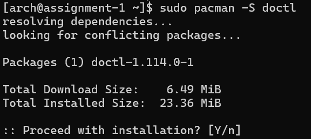
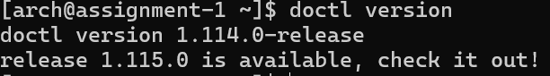
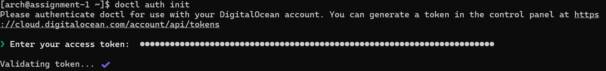
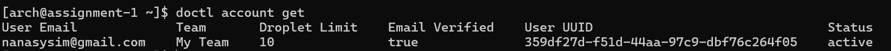
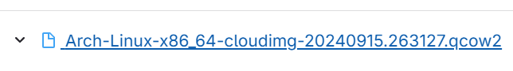
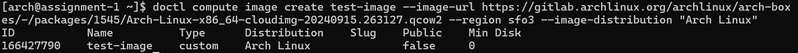
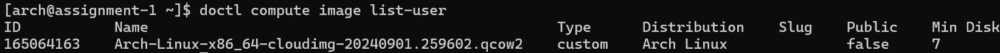
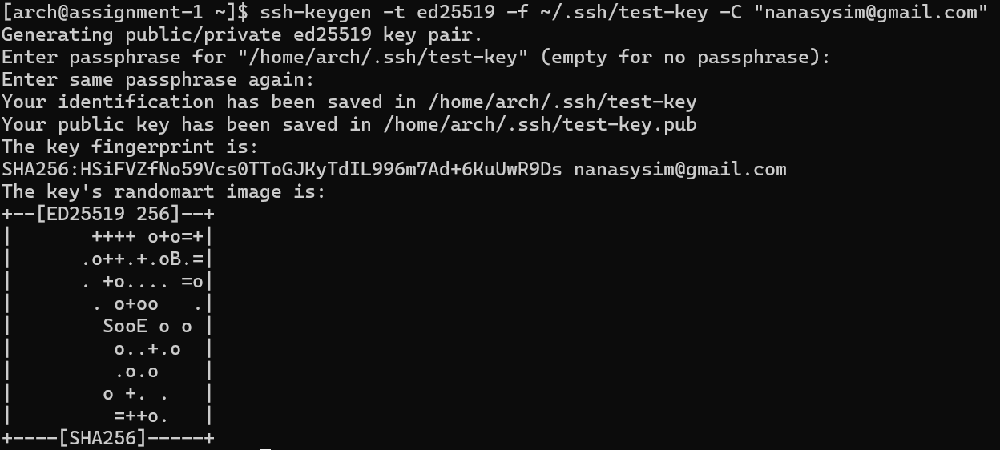
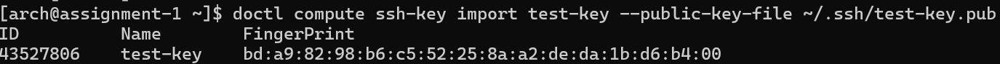
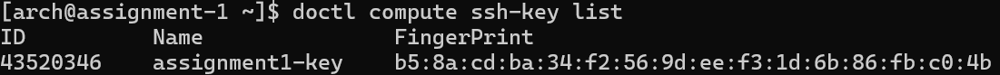

# Guide to Setting Up and Managing DigitalOcean with doctl and cloud-init

## Table of Contents
1. [Introduction](#introduction)
2. [Prerequisites](#prerequisites)
3. [Install doctl](#1-install-doctl)
4. [Create an API Token in DigitalOcean](#2-create-an-api-token-in-digitalocean)
5. [Authenticate your API token with doctl](#3-authenticate-your-api-token-with-doctl)
6. [Create a Custom Droplet](#4-create-a-custom-droplet)
7. [SSH Key Setup](#5-ssh-key-setup)

## Introduction
Before you set up your DigitalOcean with doctl, you must have a basic understanding of what those are. 

### What is doctl?
* Open-source command-line interface (CLI) tool
* Available as precompiled binary for Linux, macOS, and Windows
* Saves time when managing resources in DigitalOcean accounts
* Simplifies more comple workflows and activities
* Provides full API access to DigitalOcean, allowing you to create, configure, and destroy resources like Droplets, Kubernetes clusters, firewalls, load balancers, database clusters, domains, and more

### What is DigitalOcean?
* Offers a range of cloud services to help developers and businesses deploy, manage, and scale application
* Provides virtual machines (droplets), which can be used to host websites, applications, and other services

### Why use doctl to Set up and Manage DigitalOcean?
* doctl allows you to interact with DigitalOcean via the command line
* doctl supprots all functionalities found in the DigitalOcean control panel
* Enables you to create, configure, and destroy DigitalOcean resources like Droplets, Kubernetes clusters, firewalls, load balancers, database clusters, domains, and more

## Prerequisites
* A DigitalOcean account
* A GitHub account
* An Arch Linux Droplet

Now that you know some general information and the prerequisites, let's get started.

## 1. Install doctl
Before you set up your DigitalOcean, you must make sure that you have doctl successfully installed on your computer. 

### Step 1: Run this command to download the latest version of doctl
```sudo pacman -S doctl``` 
* This command installs doctl on Arch Linux

**This is how it looks on the Terminal:**  


* this command installs doctl on Arch Linux

### Step 2: Verify that doctl is installed by running this command
```doctl version```
* This command checks the version of doctl installed on your computer

**This is how it looks on the Terminal:** 



Now that you have doctl installed, you can proceed to set up your DigitalOcean account.

## 2. Create an API Token in DigitalOcean
Before you can use doctl to manage your DigitalOcean resources, you need to create an API token in DigitalOcean. This token will allow you to authenticate your doctl commands with DigitalOcean.

### What is an API Token?
* Unique identifier used to authenticate a user, developer, or application when interacting with an API
* Think of it like a digital key that grants access to specific resources or actions provided by the API

### Why do you need an API Token?
* Required to authenticate your doctl commands with DigitalOcean
* Ensures only authorized users can access and manage your DigitalOcean resources
* Can be configured with specific permissions to restrict access to certain resources or actions
* Help track usage and monitor activity
* Simplify the authentication process 

Now let's create an API token in DigitalOcean.

### Step 1: Log in to DigitalOcean and navigate to the API section
1. Log in to your DigitalOcean account
2. Click on the "API" link in the left-hand navigation menu


### Step 2: Generate a New Token
1. Click on the **Generate New Token** button  


This will open a page that looks like this:  


### Step 3: Fill out the token details
* Token name: Give your token a descriptive name to help you identify its purpose
* Expiration: Choose when you want the token to expire (optional)
* Scopes: Select the permissions you want to grant to this token

>[!NOTE]
>Keep tokens secure, as they function like passwords. If a token is compromised, revoke it immediately.

## 3. Authenticate your API token with doctl
After you have created an API token in DigitalOcean, you need to authenticate it with doctl. This will allow you to use doctl to manage your DigitalOcean resources.
### Step 1: Run this command to authenticate your API token with doctl
```doctl auth init```
* This command initializes the authentication process with doctl

### Step 2: Enter your API token when prompted

**This is how it looks on the Terminal:**


### Step 3: Verify that you are authenticated by running this command
```doctl account get```

**This is how it looks on the Terminal:**  

* You should get an output similar to this

Congratulations! You have successfully authenticated your API token with doctl. You can now use doctl to manage your DigitalOcean resources.

## 4. Create a Custom Droplet
Now that you have doctl installed and authenticated, you can create a custom Droplet in DigitalOcean using doctl. A Droplet is a virtual private server that you can use to host websites, applications, and other services.

### Step 1: Get the custom image
1. Go to [this website](https://gitlab.archlinux.org/archlinux/arch-boxes/-/packages/1545)
2. Find the latest version of the cloud image for Arch Linux that ends with `.qcow2`  
  
3. Copy the link to the image
   
### Step 2: Run the command below to upload the image to your DigitalOcean account
```doctl compute image create <custom image name> --image-url <image link> --region <region> --image-distribution <distro name>```  
Replace these placeholders with the appropriate values:
* `<custom image name>`: The name you want to give to your custom image
* `<image link>`: The link to the Arch Linux cloud image ending with `.qcow2`
* `<region>`: The region where you want to create the image (e.g., `sfo3`)
* `<distro name>`: The name of the distribution (e.g., `Arch Linux`)

For this instance, run this command ```doctl compute image create test-image --image-url https://gitlab.archlinux.org/archlinux/arch-boxes/-/packages/1545/Arch-Linux-x86_64-cloudimg-20240915.263127.qcow2 --region sfo3 --image-distribution "Arch Linux"```

What this command does:
* Creates a custom image in your DigitalOcean account

**This is how it looks on the Terminal:**  


### Step 3: Verify that the image was created by running this command
```doctl compute image list-user```  
What this command does:
* Lists the custom images you have created in your DigitalOcean account

**This is how it looks on the Terminal:**  


Congratulations! You have successfully created a custom image in DigitalOcean. 

## 5. SSH Key Setup
Before you can create a Droplet, you need to set up an SSH key in DigitalOcean. This will allow you to securely access your Droplet via SSH without needing a password.

### What is an SSH Key?
* Secure Shell (SSH) key pair used for secure communication between a client and a server
* Consists of a public key and a private key
* Public key is placed on the server, while the private key is kept on the client
* Provides a secure way to authenticate and access a server without using a password

### Why do you need an SSH Key?
* Securely access your Droplet via SSH without needing a password
* Enhance security by using public-key cryptography
* Prevent unauthorized access to your server
* Simplify the authentication process

Now let's set up an SSH key in DigitalOcean.

### Step 1: Generate an SSH Key Pair
1. Open a terminal on your local machine
2. Run this command to generate an SSH key pair
```ssh-keygen -t ed25519 -f ~/.ssh/<key-name> -C "<youremail@email.com>"```
Replace these placeholders with the appropriate values:
* `<key-name>`: The name you want to give to your SSH key pair
* `<your email address>`: Your email address
What this command does:
* Generates an SSH key pair using the Ed25519 algorithm
* One key pair is a private key which is stored within the `~/.ssh` directory
* The other key pair is a public key which will be used to authenticate with the server

1. Press Enter
2. Enter a passphrase (optional)
3. Press Enter again

**This is how it looks on the Terminal:**


### Step 2: Add the Public Key to DigitalOcean by using doctl
1. Run this command to add the public key to DigitalOcean
```doctl compute ssh-key import <key-name> --public-key-file ~/.ssh/<key-name>.pub```
Replace these placeholders with the appropriate values:
* `<key-name>`: The name you gave to your SSH key pair
* `<key-name>.pub`: The public key file path
* What this command does:
* Adds the public key to your DigitalOcean account
* Allows you to use the private key to authenticate with your Droplet

**This is how it looks on the Terminal:**


### Step 3: Verify that the SSH key was added by running this command
```doctl compute ssh-key list```
What this command does:
* Lists the SSH keys you have added to your DigitalOcean account

**This is how it looks on the Terminal:**


Congratulations! You have successfully set up an SSH key in DigitalOcean. You can now create a Droplet and securely access it via SSH.

## 6. Configure Cloud-Init
### What is Cloud-Init?
* Multi-distribution package that handles early initialization of a cloud instance
* Supports a variety of cloud providers, including DigitalOcean
* Enables you to configure your Droplet during its first boot
* Automates the process of setting up your Droplet with user data, scripts, and other configurations

### Why use Cloud-Init?
* Automates the configuration of your Droplet
* Saves time by setting up your Droplet with user data, scripts, and other configurations

Now let's configure Cloud-Init for your Droplet.