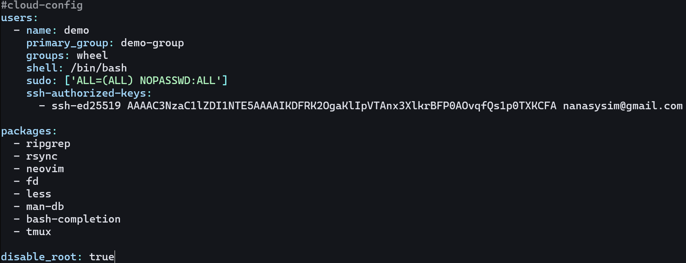

# Guide to Setting Up a DigitalOcean Droplet with doctl and cloud-init

## Table of Contents
1. [Introduction](#introduction)
2. [Prerequisites](#prerequisites)
3. [Install doctl](#1-install-doctl)
4. [Create an API Token in DigitalOcean](#2-create-an-api-token-in-digitalocean)
5. [Authenticate your API token with doctl](#3-authenticate-your-api-token-with-doctl)
6. [Create a Custom Droplet](#4-create-a-custom-droplet)
7. [SSH Key Setup](#5-ssh-key-setup)
8. [Configure Cloud-Init](#6-configure-cloud-init)
9. [Deploy a Droplet with Cloud-Init](#7-deploy-a-droplet-with-cloud-init)
10. [References](#8-references)

## Introduction
Before you set up your DigitalOcean with doctl, you must have a basic understanding of what those are. 

### What is doctl?
* Open-source command-line interface (CLI) tool
* Available as precompiled binary for Linux, macOS, and Windows
* Simplifies more complex workflows and activities
* Provides full API access to DigitalOcean, allowing you to create, configure, and destroy resources like Droplets, Kubernetes clusters, firewalls, load balancers, database clusters, domains, and more

### What is DigitalOcean?
* Offers a range of cloud services to help developers and businesses deploy, manage, and scale applications
* Provides virtual machines (droplets), which can be used to host websites, applications, and other services

### Why use doctl to Set up and Manage DigitalOcean?
* `doctl` allows you to interact with DigitalOcean via the command line
* `doctl` supports all functionalities found in the DigitalOcean control panel
* Enables you to create, configure, and destroy DigitalOcean resources like Droplets, Kubernetes clusters, firewalls, load balancers, database clusters, domains, and more

## Prerequisites
* A DigitalOcean account
* An Arch Linux Droplet

Now that you know some general information and the prerequisites, let's get started.

## 1. Install doctl
Before you set up your DigitalOcean, you must make sure that you have doctl successfully installed on your Linux droplet. 

### Step 1: Download the latest version of doctl
1. Run this command to download the latest version of `doctl`
```
sudo pacman -S doctl
``` 
* `sudo` allows you to run the command as a super user
* `pacman` is the package manager for Arch Linux
* `-S` installs the specified package
* `doctl` is the package name for the DigitalOcean command-line interface

2. Type `Y` when prompted to confirm the installation

**This is how it looks on the Terminal:**  


### Step 2: Verify that doctl is installed by running this command
```
doctl version
```
* `doctl version` displays the version of doctl installed on your computer

**This is how it looks on the Terminal:** 


Now that you have doctl installed, you can proceed to set up your API token to connect it with your DigitalOcean account.

## 2. Create an API Token in DigitalOcean
Before you can use `doctl` to manage your DigitalOcean resources, you need to create an API token in DigitalOcean. This token will allow you to authenticate your doctl commands with DigitalOcean.

### What is an API Token?
* Unique identifier used to authenticate a user, developer, or application when interacting with an API
* Think of it like a digital key that grants access to specific resources or actions provided by the API

### Why do you need an API Token?
* Required to authenticate your doctl commands with DigitalOcean
* Ensures only authorized users can access and manage your DigitalOcean resources
* Think of it like using a password to access your account

Now let's create an API token in DigitalOcean.

### Step 1: Log in to DigitalOcean and navigate to the API section
1. Log in to your DigitalOcean account
2. Click on the **API** link in the left-hand navigation menu


### Step 2: Generate a New Token
1. Click on the **Generate New Token** button  


This will open a page that looks like this:  


### Step 3: Fill out the token details
* Token name: Give your token a descriptive name to help you identify its purpose
* Expiration: Choose when you want the token to expire (optional)
* Scopes: Select the permissions you want to grant to this token

>[!NOTE]
>Keep tokens secure, as they function like passwords. If a token is compromised, revoke it immediately.

## 3. Authenticate your API token with doctl
After you have created an API token in DigitalOcean, you need to authenticate it with `doctl`. This will allow you to use doctl to manage your DigitalOcean resources.
### Step 1: Run this command to authenticate your API token with doctl
```
doctl auth init
```
* `doctl auth init` initializes the authentication process with DigitalOcean

### Step 2: Enter your API token when prompted

**This is how it looks on the Terminal:**


### Step 3: Verify that you are authenticated by running this command
```
doctl account get
```
* `doctl account get` retrieves information about your DigitalOcean account

**This is how it looks on the Terminal:**  

* You should get an output similar to this

Congratulations! You have successfully authenticated your API token with `doctl`. You can now use `doctl` to manage your DigitalOcean resources.

## 4. Create a Custom Droplet
Now that you have `doctl` installed and authenticated, you can create a custom Droplet in DigitalOcean. A Droplet is a virtual private server that you can use to host websites, applications, and other services.

### Step 1: Get the custom image
1. Go to [this website](https://gitlab.archlinux.org/archlinux/arch-boxes/-/packages/1545)
2. Find the latest version of the cloud image for Arch Linux that ends with `.qcow2`  
  
3. Copy the link to the image
   
### Step 2: Run the command below to upload the image to your DigitalOcean account
```
doctl compute image create <custom image name> --image-url <image link> --region <region> --image-distribution <distro name>
```  
Replace these placeholders with the appropriate values:
* `<custom image name>`: The name you want to give to your custom image
* `<image link>`: The link to the Arch Linux cloud image ending with `.qcow2`
* `<region>`: The region where you want to create the image (e.g., `sfo3`)
* `<distro name>`: The name of the distribution (e.g., `Arch Linux`)

For this instance, run this command: 
```
doctl compute image create test-image --image-url https://gitlab.archlinux.org/archlinux/arch-boxes/-/packages/1545/Arch-Linux-x86_64-cloudimg-20240915.263127.qcow2 --region sfo3 --image-distribution "Arch Linux"
```

* `doctl compute image create` creates a custom image in your DigitalOcean account
* `test-image` is the name of the custom image
* `--image-url` specifies the URL of the image you want to upload
* `--region` specifies the region where you want to create the image
* `--image-distribution` specifies the distribution of the image

**This is how it looks on the Terminal:**  


### Step 3: Verify that the image was created by running this command
```
doctl compute image list-user
```  
* `doctl compute image list-user` lists the custom images you have created in your DigitalOcean account

**This is how it looks on the Terminal:**  


Congratulations! You have successfully created a custom image in DigitalOcean. 

## 5. SSH Key Setup
Before you can create a Droplet, you need to set up an SSH key in DigitalOcean. This will allow you to securely access your Droplet via SSH without needing a password.

### What is an SSH Key?
* Secure Shell (SSH) key pair used for secure communication between a client and a server
* Consists of a public key and a private key
* Public key is placed on the server, while the private key is kept on the client

### Why do you need an SSH Key?
* Securely access your Droplet via SSH without needing a password
* Enhance security by using public-key cryptography
* Prevent unauthorized access to your server
* Simplify the authentication process

Now let's set up an SSH key in DigitalOcean.

### Step 1: Generate an SSH Key Pair
1. Run this command to generate an SSH key pair
```
ssh-keygen -t ed25519 -f ~/.ssh/<key-name> -C "<youremail@email.com>"
```
Replace these placeholders with the appropriate values:
* `<key-name>`: The name you want to give to your SSH key pair
* `<your email address>`: Your email address

What this command does:
* `ssh-keygen` generates an SSH key pair
* `-t ed25519` specifies the type of key to generate (Ed25519)
* `-f ~/.ssh/<key-name>` specifies the file path for the key pair
* `-C "<your email address>"` adds a comment to the key pair with your email address

2. Press **Enter**
3. Enter a passphrase (optional)
4. Press **Enter** again

**This is how it looks on the Terminal:**


### Step 2: Add the Public Key to DigitalOcean by using doctl
1. Run this command to add the public key to DigitalOcean
```
doctl compute ssh-key import <key-name> --public-key-file ~/.ssh/<key-name>.pub
```
Replace these placeholders with the appropriate values:
* `<key-name>`: The name you gave to your SSH key pair
* `<key-name>.pub`: The public key file path  

What this command does:
* Adds the public key to your DigitalOcean account
* Allows you to use the private key to authenticate with your Droplet

**This is how it looks on the Terminal:**


### Step 3: Verify that the SSH key was added by running this command
```
doctl compute ssh-key list
```
What this command does:
* Lists the SSH keys you have added to your DigitalOcean account

**This is how it looks on the Terminal:**


Congratulations! You have successfully set up an SSH key in DigitalOcean. You can now create a Droplet and securely access it via SSH.

## 6. Configure Cloud-Init
### What is Cloud-Init?
* Multi-distribution package that handles early initialization of a cloud instance
* Enables you to configure your Droplet during its first boot
* Automates the process of setting up your Droplet with user data, scripts, install packages, and other configurations

### Why use Cloud-Init?
* Automates the configuration of your Droplet
* Saves time by setting up your Droplet

Now let's configure Cloud-Init for your Droplet.

### Step 1: Make sure you have neovim installed
1. Run this command to install neovim
```
sudo pacman -S neovim
```
* This command installs neovim on Arch Linux

> [!NOTE] If you already have neovim installed, you can skip this step.

### Step 2: Create a Cloud-Init configuration file
1. Run this command to create a Cloud-Init configuration file
```
nvim cloud-init.yml
```
* This command opens a new file named `cloud-init.yml` in neovim

2. Copy and paste this to the file
```
#cloud-config
users:
  - name: <user name>
    primary_group: <user group>
    groups: wheel
    shell: /bin/bash
    sudo: ['ALL=(ALL) NOPASSWD:ALL']
    ssh-authorized-keys:
      - ssh-ed25519 <your ssh public key string>

packages:
  - ripgrep
  - rsync
  - neovim
  - fd
  - less
  - man-db
  - bash-completion
  - tmux

disable_root: true
```   

* Replace these placeholders with the appropriate values:
* `<user name>`: The name you want to give to the user
* `<user group>`: The group you want to assign to the user
* `<your ssh public key string>`: The public key string from your SSH key pair
  * Run this command to get the public key string
       ```
       cat ~/.ssh/<your ssh key ending in .pub>
       ``` 
    * What this command does: 
      * `cat` displays the contents of a file
      * `~/.ssh/<your ssh key ending in .pub>` specifies the path to your public key file
    * Copy paste the string so that you can paste it to the `cloud-init.yml` file

**This is how it looks on the Terminal:**



3. Save and exit the file
   1. You can save by pressing `esc`, type `:wq` then press **Enter**

Now that you have configured the ```cloud-init.yaml``` file, you are ready to deploy your Droplet with Cloud-Init. 

## 7. Deploy a Droplet with Cloud-Init
### Step 1: Run this command
```
doctl compute droplet create --image <image ID> --size <your preferred size> --ssh-keys <SSH key ID> --region <your preferred region slug> --user-data-file ~/cloud-init.yml --wait <droplet name>
``` 
Replace these placeholders with the appropriate values:
* `<image ID>`: The ID of the custom image you created
  * You can view this by running
    ```
    doctl compute image list
    ```
    * This will list all the images available and the custom image you created 
* `<your preferred size>`: The size of the Droplet you want to create (e.g., `s-1vcpu-1gb`)
  * You can view the available sizes by running
    ```
    doctl compute size list
    ```
    * This will list all the sizes available
* `<SSH key ID>`: The ID of the SSH key you added to your DigitalOcean account
  * You can view this by running
    ```
    doctl compute ssh-key list
    ```
    * This will list all the SSH keys available
* `<your preferred region slug>`: The region where you want to create the Droplet (e.g., `sfo3`)
  * You can view the available regions by running 
    ```
    doctl compute region list
    ```
    * This will list all the regions available
* `<droplet name>`: The name you want to give to your Droplet  
  
What this command does: 
* `doctl compute droplet create` creates a new Droplet
* `--image <image ID>` specifies the custom image you created
* `--size s-1vcpu-1gb` specifies the size of the Droplet, in this case, 1 vCPU and 1 GB of RAM
* `--ssh-keys <SSH key ID>` specifies the SSH key you added to your DigitalOcean account
* `--region <your preferred region slug>` specifies the region where you want to create the Droplet
* `--user-data-file ~/cloud-init.yml` specifies the Cloud-Init configuration file
* `--wait` waits for the Droplet to be created before returning
* `<droplet name>` specifies the name you want to give to your Droplet

**This is how it looks on the Terminal:** 


> [!NOTE]
> It may take a few minutes for the Droplet to be created. 

### Step 2: Connect to your Droplet
```
ssh example-user@<your-droplet-ip-address>
``` 
Replace these placeholders with the appropriate values:
* `example-user`: The user you specified in the Cloud-Init configuration
* `<your-droplet-ip-address>`: The IP address of your Droplet
  
What this command does:
*  `ssh` connects to your Droplet via SSH
* `example-user@<your-droplet-ip-address>` specifies the user and IP address of your Droplet

**This is how it looks on the Terminal:**  


Congratulations! You have successfully deployed a Droplet with Cloud-Init. You can now access your Droplet via SSH and start using it.

### Step 3: Verify that cloud-init installed the packages
One of the packages that you installed with this guide is neovim. You can check that it was installed by running this command.
```
nvim --version
```
* This command checks the version of neovim installed on your Droplet

**This is how it looks on the Terminal:**  


Congratulations! This concludes the guide to setting up and managing DigitalOcean with doctl and cloud-init. You have successfully created a custom Droplet, set up an SSH key, configured Cloud-Init, and deployed a Droplet with Cloud-Init.

## 8. References

Canonical Group. (2024). Introduction to cloud-init. Cloud-init 24.3.1 documentation. https://docs.cloud-init.io/en/latest/explanation/introduction.html  

DigitalOcean. (2024, June 21). Doctl Command Line Interface (CLI). DigitalOcean Documentation. https://docs.digitalocean.com/reference/doctl/#:~:text=doctl%20allows%20you%20to%20interact%20with%20the%20DigitalOcean,firewalls%2C%20load%20balancers%2C%20database%20clusters%2C%20domains%2C%20and%20more

DigitalOcean. (2024, August 14). How to Automate Droplet Setup with cloud-init. DigitalOcean Documentation. https://docs.digitalocean.com/products/droplets/how-to/automate-setup-with-cloud-init/

DigitalOcean. (2024, August 5). How to Create a Personal Access Token. DigitalOcean Documentation. https://docs.digitalocean.com/reference/api/create-personal-access-token/

DigitalOcean. (2024, August 5). How to install and configure doctl. DigitalOcean Documentation. https://docs.digitalocean.com/reference/doctl/how-to/install/


DigitalOcean. (2024, July 2). How to Upload Custom Images. DigitalOcean Documentation. https://docs.digitalocean.com/products/custom-images/how-to/upload/

GitHub Docs. (2024). Adding a new SSH key to your GitHub account. https://docs.github.com/en/authentication/connecting-to-github-with-ssh/adding-a-new-ssh-key-to-your-github-account

Liles, B. (2016, March 28). Introducing doctl: the Command Line Interface to DigitalOcean. https://www.digitalocean.com/blog/introducing-doctl

Walker, J. (2021, February 8). How to Get Started With Doctl, DigitalOcean’s Command-Line Client. https://www.howtogeek.com/devops/how-to-get-started-with-doctl-digitaloceans-command-line-client/#:~:text=Learning%20doctl%20can%20save%20you%20time%20when%20managing,supports%20almost%20all%20API%20operations%20and%20resource%20types